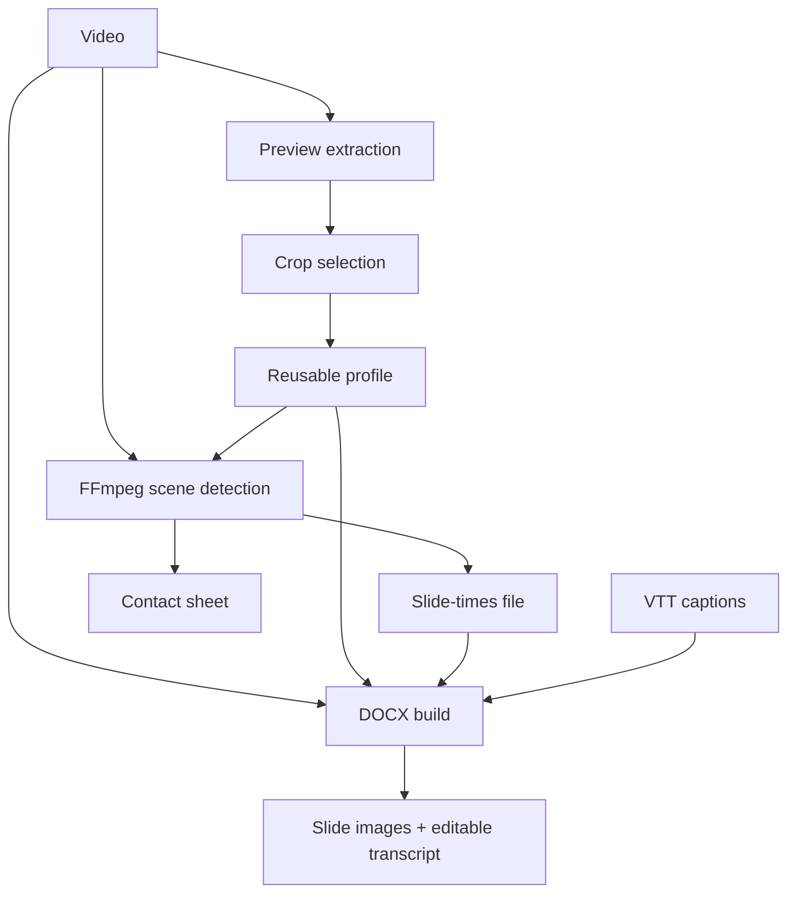

# Architecture

## Processing flow

Both front ends call synchronous service functions. Long GUI jobs run those functions on `QThread`; services report structured progress and accept a cancellation token. Processing modules do not print directly.

## Public entry points

- `slides-docx = slides_docx.cli:main`
- `python -m slides_docx`
- `slides-docx-gui = slides_docx.gui:main`
- `python -m slides_docx.gui`

PySide6 is imported lazily, so CLI-only installations do not require the GUI extra.

## Main module responsibilities

| Module | Responsibility |
| --- | --- |
| `cli.py` | `argparse` tree, option validation, terminal progress, profile management, completion entry point. |
| `services.py` | Shared orchestration through typed request/result dataclasses, settings resolution, progress, and cancellation. |
| `video.py` | Tool discovery, probing, frame extraction, FFmpeg scene detection, subprocess cancellation. |
| `crop.py` | Crop resolution and precedence, including profile fingerprint verification. |
| `profiles.py` | Versioned JSON profile storage, validation, scaling, settings, atomic writes, fingerprints. |
| `timestamps.py` | Slide-times metadata and numeric timestamp serialization with atomic writes. |
| `content.py` | VTT parsing, transcript assignment, timestamp formatting, screenshot-time selection. |
| `contact_sheet.py` | Four-column JPEG preview built from cropped frames. |
| `document.py` | Optional PNG slide extraction plus alternating image/transcript pages or portrait transcript-only DOCX sections. |
| `completion.py` | Parser-driven completion engine and Bash/Zsh/Fish/PowerShell adapters. |
| `gui/app.py` | Four-stage Qt window, background workers, validation dialogs, native file opening. |
| `gui/widgets.py` | Collapsible panels and source-coordinate crop selection widget. |
| `gui/theme.py` | System-aware light/dark themes with palette fallback and live switching. |

## Service interface

`services.py` exposes immutable request and result dataclasses:

- `PreviewRequest` / `PreviewResult`
- `DetectRequest` / `DetectResult`
- `BuildRequest` / `BuildResult`
- `ProgressEvent`
- `CancellationToken`

The primary jobs are `extract_preview`, `detect_slides`, and `build_docx`. Crop saving is exposed through `save_crop_profile`.

`ProgressEvent` contains a stage, optional message, current value, and total. Its `fraction` property clamps determinate progress to `0..1`; absent totals represent indeterminate work.

Cancellation is cooperative. Services check the token between stages, and FFmpeg subprocess helpers terminate and then kill a process if needed. A cancelled job raises `JobCancelledError`, a subtype of `SlidesDocxError`.

## FFmpeg integration

Tool resolution order is:

1. `SLIDES_DOCX_TOOL_DIR`.
2. The AppImage `APPDIR` bundled-tool location.
3. `Contents/Resources/bin` relative to a macOS `.app/Contents/MacOS` executable.
4. `tools`, `bin`, or the executable directory beside another frozen application.
5. The user's `PATH`.

Windows tool names receive `.exe` automatically. The macOS bundle keeps `ffmpeg` and `ffprobe` under `Slides DOCX.app/Contents/Resources/bin`; they are found without Homebrew or changes to `PATH`.

Detection applies `crop`, then `scale=640:-2`, then FFmpeg's `scdet` filter. FFmpeg sends machine-readable progress on stderr and scene metadata on stdout; these streams are consumed separately to prevent blocking.

Frame extraction seeks with `-ss` before input, applies the same crop, and writes one frame. DOCX screenshots use PNG because `python-docx` rejected some otherwise valid FFmpeg JPEG variants.

## GUI implementation

`MainWindow` owns one active `JobThread`. A worker wraps a service call and emits success, failure, cancellation, and progress signals. Navigation is disabled while work runs. Closing the application cancels the active job and waits briefly.

The crop widget stores rectangles in source-image coordinates and maps them to the scaled display rectangle during painting and mouse interaction. The area outside the current selection is darkened.

The application installs a complete Qt stylesheet based on `QStyleHints.colorScheme()`, falling back to palette brightness when the scheme is unknown. A `colorSchemeChanged` connection reapplies the theme live.

## Dependency model

Core dependencies:

- `python-docx`
- `opencv-python`
- `platformdirs`
- System FFmpeg and FFprobe for CLI installations

Optional `gui` dependency:

- `PySide6`

Optional `desktop-build` dependencies add Nuitka and its build helpers. The `pyproject.toml` dependency declarations are authoritative; `requirements.txt` contains `.` as a compatibility installation route.

## Desktop bundle layouts

The Linux AppImage uses `Slides_DOCX.AppDir/usr/lib/slides-docx/` for the frozen application and media tools. The macOS artifact uses a standard `Slides DOCX.app` bundle: the frozen executable and Qt frameworks live under `Contents`, media tools are in `Contents/Resources/bin`, and FFmpeg/Python license inventories are in `Contents/Resources/licenses`.

`pysidedeploy.spec` and `packaging/macos/pysidedeploy.spec.in` are templates. `packaging/render_deploy_spec.py` inserts the checkout and active Python paths at build time, keeping machine-specific paths out of source control.
