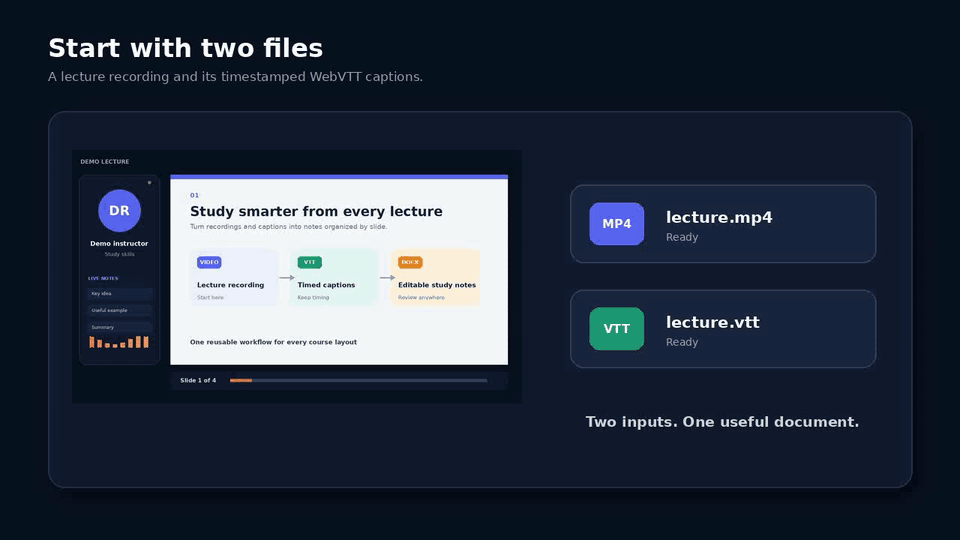
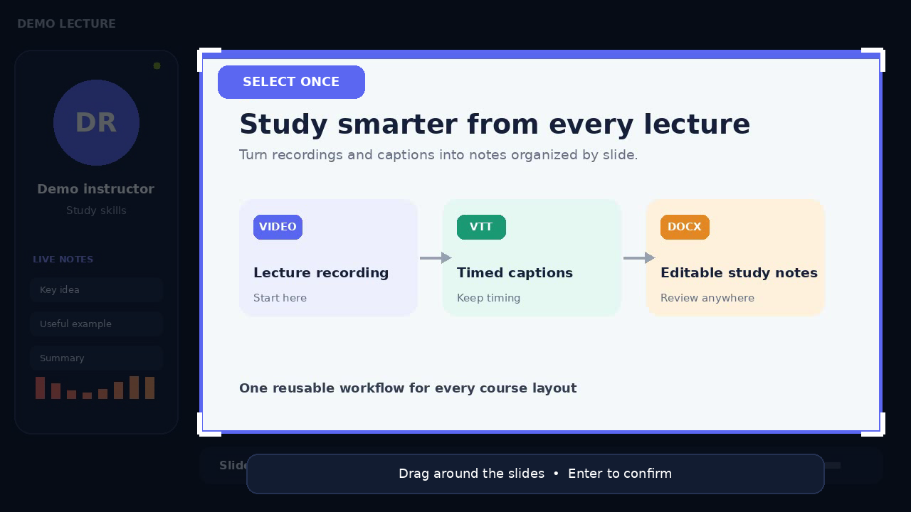
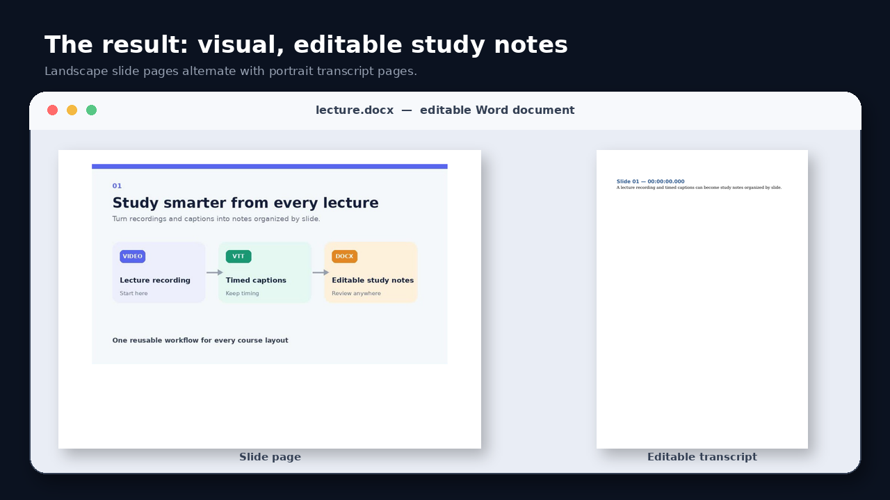
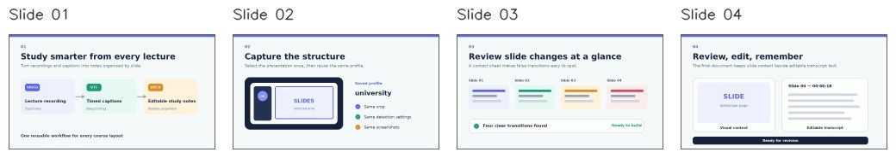
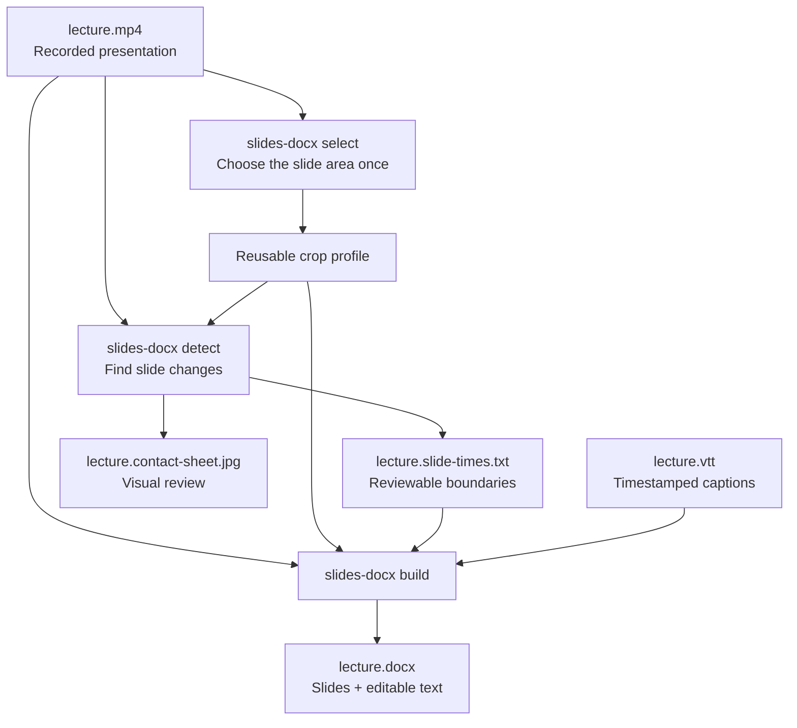

# Slides DOCX

[](https://github.com/Dreyvor/Slides-docx/actions/workflows/tests.yml)

**Lecture recording + captions → illustrated, editable Word notes.**

`slides-docx` finds slide changes in a recorded presentation, pairs each slide with its timestamped transcript, and creates a Word document you can edit, search, highlight, and print.

[](docs/assets/demo.mp4)

[Watch the 40-second demo](docs/assets/demo.mp4)

[Download the Linux desktop preview](https://github.com/Dreyvor/Slides-docx/releases/latest) — Python and FFmpeg are included.

## See the result

| Select the slide area once | Get slides with editable transcript text |
| --- | --- |
|  |  |

The crop is saved as a [reusable profile](#selecting-and-reusing-slide-areas). Movement in presenter video, chat, or other parts of the recording stays outside [slide detection](#slide-detection) and outside the [final screenshots](#building-the-docx).

## Quick start

[Install the application](#installation), then open a terminal in the folder containing `lecture.mp4` and `lecture.vtt`.

For the first recording layout, [select the slide area](#selecting-and-reusing-slide-areas) and create the document:

```bash
slides-docx select lecture.mp4 --profile university
slides-docx detect lecture.mp4
slides-docx build lecture.mp4 lecture.vtt
```

Drag around the slides during selection, then press Enter or Space. For every later lecture with the same layout, run [slide detection](#slide-detection) and [build the DOCX](#building-the-docx) with two commands:

```bash
slides-docx detect lecture.mp4
slides-docx build lecture.mp4 lecture.vtt
```

This creates:

```text
lecture.slide-times.txt
lecture.contact-sheet.jpg
lecture.docx
```

Review the four-column [contact sheet](#slide-detection) before [building the DOCX](#building-the-docx) to spot false or duplicate transitions:



The [slide-times file](#slide-detection), `lecture.slide-times.txt`, remains a simple, editable list of slide boundaries. The [final DOCX](#building-the-docx) alternates between a landscape slide page and a portrait page of normal editable transcript text.

## Desktop app

Tagged releases provide an unsigned Linux x86_64 AppImage with the application, Python, FFmpeg, and FFprobe included. Download `Slides_DOCX-<version>-x86_64.AppImage` from [GitHub Releases](https://github.com/Dreyvor/Slides-docx/releases/latest), make it executable, and open it:

```bash
chmod +x Slides_DOCX-*-x86_64.AppImage
./Slides_DOCX-*-x86_64.AppImage
```

The guided interface walks through choosing the video and captions, selecting or reusing a slide profile, reviewing the contact sheet, and creating the DOCX. It follows the desktop's light or dark appearance automatically. Advanced detection and screenshot settings remain available in collapsed panels. Because the preview is unsigned, some desktop environments may ask you to confirm that the downloaded file is trusted.

To run the GUI from a source checkout instead:

```bash
pipx install '.[gui]'
slides-docx-gui
```

The command-line interface remains available for automation and terminal workflows.

## Table of contents

- [Desktop app](#desktop-app)
- [How it works](#how-it-works)
- [Requirements](#requirements)
- [Installation](#installation)
  - [macOS](#macos)
  - [Linux](#linux)
  - [Windows](#windows)
  - [Verify or update](#verify-or-update)
- [Selecting and reusing slide areas](#selecting-and-reusing-slide-areas)
- [Slide detection](#slide-detection)
- [Building the DOCX](#building-the-docx)
- [Headless systems](#headless-systems)
- [Shell autocompletion](#shell-autocompletion)
- [Development installation](#development-installation)
- [License](#license)

## How it works



## Requirements

The AppImage includes its runtime requirements. Command-line installations require:

- [Python 3.10 or newer](https://www.python.org/downloads/)
- [FFmpeg and FFprobe](https://ffmpeg.org/download.html), available on `PATH`
- A desktop session for [visual crop selection](#selecting-and-reusing-slide-areas)

The Python dependencies (`python-docx`, `opencv-python`, and `platformdirs`) are installed automatically during [installation](#installation).

## Installation

This section installs the command-line application. Linux desktop users can use the self-contained [AppImage](#desktop-app).

[`pipx`](https://pipx.pypa.io/latest/how-to/install-pipx.html) installs the application in an isolated environment and makes `slides-docx` available in every terminal.

### macOS

Install FFmpeg and pipx with [Homebrew](https://brew.sh/):

```bash
brew install ffmpeg pipx
pipx ensurepath
```

Open a new terminal, clone this repository, enter it, and install the application:

```bash
git clone https://github.com/Dreyvor/Slides-docx.git
cd Slides-docx
pipx install .
```

Finder can open a terminal in a lecture folder through **Services → New Terminal at Folder**. If the action is hidden, enable it under **System Settings → Keyboard → Keyboard Shortcuts → Services**.

### Linux

On recent Ubuntu or Debian systems:

```bash
sudo apt update
sudo apt install ffmpeg pipx
pipx ensurepath
```

Other distributions provide equivalent FFmpeg and pipx packages. Open a new terminal, clone the repository, and install it:

```bash
git clone https://github.com/Dreyvor/Slides-docx.git
cd Slides-docx
pipx install .
```

The exact file-manager action varies by desktop environment; it is commonly named **Open in Terminal**.

### Windows

Install [Python](https://www.python.org/downloads/windows/) and [FFmpeg](https://ffmpeg.org/download.html), and ensure `ffmpeg` and `ffprobe` are on `PATH`. Then install pipx from PowerShell:

```powershell
py -m pip install --user pipx
py -m pipx ensurepath
```

Restart the terminal, clone the repository, enter it, and run:

```powershell
git clone https://github.com/Dreyvor/Slides-docx.git
cd Slides-docx
pipx install .
```

On Windows 11, right-click inside a lecture folder in File Explorer and choose **Open in Terminal**.

### Verify or update

Verify the installation on any operating system:

```bash
slides-docx --version
ffmpeg -version
ffprobe -version
```

To reinstall after updating the repository, or to uninstall:

```bash
pipx install --force .
pipx uninstall presentation-transcript-docx
```

## Selecting and reusing slide areas

The selector uses a frame at 30 seconds by default. Choose another frame with seconds, `MM:SS`, or `HH:MM:SS`:

```bash
slides-docx select lecture.mp4 --profile university --at 12:30
```

The selected rectangle is stored in the operating system's user configuration directory rather than beside every video:

- macOS: `~/Library/Application Support/slides-docx/config.json`
- Linux: `$XDG_CONFIG_HOME/slides-docx/config.json` or `~/.config/slides-docx/config.json`
- Windows: `%APPDATA%\slides-docx\config.json`

The most recently selected profile becomes active. List, activate, or delete profiles with:

```bash
slides-docx profiles
slides-docx profiles activate university
slides-docx profiles delete zoom
```

An active profile cannot be deleted until another profile is activated. A saved crop scales automatically for videos with the same aspect ratio. Videos with a materially different aspect ratio require a new selection.

Profiles can also remember reusable processing settings. When `--profile NAME` is explicitly combined with `--threshold`, `--min-gap`, `--contact-sheet`, `--no-contact-sheet`, or `--lead`, those supplied values are saved after the command succeeds. Selecting the crop again under the same profile name preserves its settings.

For each setting, an option supplied on the command line takes precedence over the saved profile value, which takes precedence over the built-in default. Saved values are used when the profile is selected explicitly, is active, or is referenced by a slide-times file. Options used without an explicit `--profile` affect only that run.

[Slide detection](#slide-detection) records the profile name and fingerprint in the timestamp file. If that profile is changed before [building the DOCX](#building-the-docx), the build stops rather than silently using different screenshots. Rerun detection or explicitly select the intended crop.

## Slide detection

The default scene-change threshold is `12`. Use a higher value for fewer detections when animations or bullet reveals cause false changes:

```bash
slides-docx detect lecture.mp4 --threshold 14
```

Use a lower value such as `8` or `10` when real slide changes are missed.

Save a preferred detection configuration in a [profile](#selecting-and-reusing-slide-areas) by naming it explicitly:

```bash
slides-docx detect lecture.mp4 --profile university \
  --threshold 14 --min-gap 1.2 --no-contact-sheet
```

Future detections using the `university` profile reuse these values. Supplying only one of these options updates only that setting; the other saved values remain unchanged.

FFmpeg can report several changes during a single transition or compression artifact. Consecutive detections separated by less than 0.8 seconds are treated as one change, using the first timestamp in that group. Changes exactly 0.8 seconds apart remain separate.

Change the interval with `--min-gap`, or use `0` to disable merging:

```bash
slides-docx detect lecture.mp4 --min-gap 1.2
slides-docx detect lecture.mp4 --min-gap 0
```

Detection also creates `lecture.contact-sheet.jpg`, containing labeled thumbnails for all detected slides. It uses the video filename as its prefix and applies the same crop as detection. Skip it when it is not needed:

```bash
slides-docx detect lecture.mp4 --no-contact-sheet
```

If a profile has contact sheets disabled, enable and save them again with:

```bash
slides-docx detect lecture.mp4 --profile university --contact-sheet
```

Choose a non-active profile for one run:

```bash
slides-docx detect lecture.mp4 --profile zoom
```

Override profiles with a manual FFmpeg crop, or analyze the entire frame:

```bash
slides-docx detect lecture.mp4 --crop 1600:1080:0:0
slides-docx detect lecture.mp4 --no-crop
```

If detection uses an explicit crop, pass the same `--crop` when [building the DOCX](#building-the-docx). This avoids silently generating screenshots from a different region.

## Building the DOCX

The normal command discovers `lecture.slide-times.txt` automatically:

```bash
slides-docx build lecture.mp4 lecture.vtt
```

Use custom input or output paths when needed:

```bash
slides-docx build lecture.mp4 lecture.vtt \
  --slide-times corrected-times.txt \
  --output notes.docx
```

Add the course date with `DD.MM.YYYY`:

```bash
slides-docx build lecture.mp4 lecture.vtt --date 17.09.2026
```

This creates `2026_09_17-lecture.docx`.

Screenshots are normally taken five seconds before the following slide appears, which tends to capture completed bullet lists and diagrams. Change that offset with:

```bash
slides-docx build lecture.mp4 lecture.vtt --lead 2
```

Combine `--lead` with an [explicit profile](#selecting-and-reusing-slide-areas) to save it for later builds:

```bash
slides-docx build lecture.mp4 lecture.vtt --profile university --lead 2
```

Short slides are handled automatically by selecting a frame within the slide interval. The final slide uses the end of the video.

## Headless systems

The [OpenCV selector](#selecting-and-reusing-slide-areas) needs a graphical desktop. Over SSH, in a container, or on another headless system, use a [saved profile](#selecting-and-reusing-slide-areas) or supply a crop manually:

```bash
slides-docx detect lecture.mp4 --crop 1600:1080:0:0
slides-docx build lecture.mp4 lecture.vtt --crop 1600:1080:0:0
```

Use `--no-crop` on both commands when the video contains only the presentation.

## Shell autocompletion

`slides-docx` can complete commands, options, suitable files, and saved [crop profile](#selecting-and-reusing-slide-areas) names. Enable it temporarily in the current terminal with the command for your shell.

For Bash:

```bash
eval "$(slides-docx completion bash)"
```

Add the same line to `~/.bashrc` to enable it in future Bash sessions.

For Zsh:

```zsh
eval "$(slides-docx completion zsh)"
```

Add the same line to `~/.zshrc` to enable it in future Zsh sessions.

For Fish:

```fish
slides-docx completion fish | source
```

Install it persistently with:

```fish
mkdir -p ~/.config/fish/completions
slides-docx completion fish > ~/.config/fish/completions/slides-docx.fish
```

For PowerShell:

```powershell
slides-docx completion powershell | Out-String | Invoke-Expression
```

To enable it in future PowerShell sessions, save the generated script and load it from your PowerShell profile:

```powershell
$completionFile = Join-Path (Split-Path -Parent $PROFILE) "slides-docx-completion.ps1"
New-Item -ItemType Directory -Force (Split-Path -Parent $completionFile) | Out-Null
slides-docx completion powershell | Set-Content $completionFile
Add-Content $PROFILE ". '$completionFile'"
```

Completion reads files and crop profiles when Tab is pressed, so new profiles appear without reinstalling the application. The command only prints shell code; it never changes shell configuration itself.

## Development installation

For development without pipx:

```bash
python3 -m venv .venv
source .venv/bin/activate
python3 -m pip install -r requirements.txt
```

Install the optional desktop interface when working on the GUI:

```bash
python3 -m pip install -e '.[gui]'
python3 -m slides_docx.gui
```

On Windows, activate the environment with `.venv\Scripts\activate`.

Run the CLI directly from a repository checkout with:

```bash
python3 -m slides_docx --help
python3 -m slides_docx detect lecture.mp4
```

Run the automated tests with:

```bash
python3 -m unittest
```

The Linux AppImage build and its bundled FFmpeg license information live under `packaging/`. Tagged versions are assembled by the `Linux desktop preview` GitHub Actions workflow.

## License

I don't care, do what you want with this project. The AI coded 90% of it; it belongs to the people.
