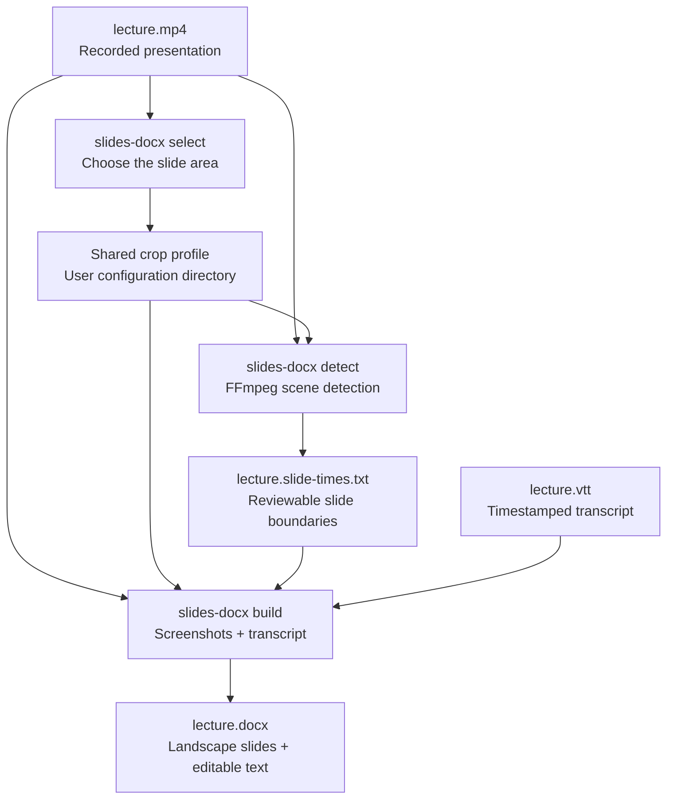

# Presentation Transcript to DOCX

Create a structured Word document from a recorded presentation and its WebVTT (`.vtt`) transcript. The generated document alternates between a slide screenshot on a landscape page and editable transcript text on a portrait page.

The tool can visually select the slide area once and reuse it across recordings with the same layout. The selected area is applied both when detecting slide changes and when extracting screenshots for the DOCX.

## Processing pipeline



## Requirements

- [Python 3.10 or newer](https://www.python.org/downloads/)
- [FFmpeg and FFprobe](https://ffmpeg.org/download.html), available on `PATH`
- A desktop session for visual crop selection

The Python dependencies (`python-docx`, `opencv-python`, and `platformdirs`) are installed automatically with the application.

## Installation

[`pipx`](https://pipx.pypa.io/latest/how-to/install-pipx.html) installs the application in an isolated environment and makes `slides-docx` available in every terminal.

### macOS

Install FFmpeg and pipx with [Homebrew](https://brew.sh/):

```bash
brew install ffmpeg pipx
pipx ensurepath
```

Open a new terminal, clone this repository, enter it, and install the application:

```bash
git clone https://github.com/YOUR_USERNAME/presentation-transcript-docx.git
cd presentation-transcript-docx
pipx install .
```

Finder can open a terminal in a lecture folder through **Services → New Terminal at Folder**. If the action is hidden, enable it under **System Settings → Keyboard → Keyboard Shortcuts → Services**.

### Linux

On recent Ubuntu or Debian systems:

```bash
sudo apt update
sudo apt install ffmpeg pipx
pipx ensurepath
```

Other distributions provide equivalent FFmpeg and pipx packages. Open a new terminal, then install from the cloned repository:

```bash
pipx install .
```

The exact file-manager action varies by desktop environment; it is commonly named **Open in Terminal**.

### Windows

Install [Python](https://www.python.org/downloads/windows/) and [FFmpeg](https://ffmpeg.org/download.html), and ensure `ffmpeg` and `ffprobe` are on `PATH`. Then install pipx from PowerShell:

```powershell
py -m pip install --user pipx
py -m pipx ensurepath
```

Restart the terminal, clone the repository, enter it, and run:

```powershell
pipx install .
```

On Windows 11, right-click inside a lecture folder in File Explorer and choose **Open in Terminal**.

Verify the installation on any operating system:

```bash
slides-docx --version
ffmpeg -version
ffprobe -version
```

To reinstall after updating the repository, or to uninstall:

```bash
pipx install --force .
pipx uninstall presentation-transcript-docx
```

## Quick start

Open a terminal in the folder containing `lecture.mp4` and `lecture.vtt`.

Select the slide area once for a recording layout:

```bash
slides-docx select lecture.mp4 --profile university
```

Drag a rectangle around the slides, then press Enter or Space. Press `C` to cancel without changing the saved configuration.

For every lecture that uses this layout, run:

```bash
slides-docx detect lecture.mp4
slides-docx build lecture.mp4 lecture.vtt
```

This creates:

```text
lecture.slide-times.txt
lecture.docx
```

`lecture.slide-times.txt` can be reviewed or edited before building the DOCX. Slide 1 implicitly begins at `0`; each number in the file marks the appearance of a new slide.

## Selecting and reusing slide areas

The selector uses a frame at 30 seconds by default. Choose another frame with seconds, `MM:SS`, or `HH:MM:SS`:

```bash
slides-docx select lecture.mp4 --profile university --at 12:30
```

The selected rectangle is stored in the operating system's user configuration directory rather than beside every video:

- macOS: `~/Library/Application Support/slides-docx/config.json`
- Linux: `$XDG_CONFIG_HOME/slides-docx/config.json` or `~/.config/slides-docx/config.json`
- Windows: `%APPDATA%\slides-docx\config.json`

The most recently selected profile becomes active. List, activate, or delete profiles with:

```bash
slides-docx profiles
slides-docx profiles activate university
slides-docx profiles delete zoom
```

An active profile cannot be deleted until another profile is activated. A saved crop scales automatically for videos with the same aspect ratio. Videos with a materially different aspect ratio require a new selection.

Detection records the profile name and fingerprint in the timestamp file. If that profile is changed before building the DOCX, the build stops rather than silently using different screenshots. Rerun detection or explicitly select the intended crop.

## Slide detection

The default scene-change threshold is `12`. Use a higher value for fewer detections when animations or bullet reveals cause false changes:

```bash
slides-docx detect lecture.mp4 --threshold 14
```

Use a lower value such as `8` or `10` when real slide changes are missed.

Choose a non-active profile for one run:

```bash
slides-docx detect lecture.mp4 --profile zoom
```

Override profiles with a manual FFmpeg crop, or analyze the entire frame:

```bash
slides-docx detect lecture.mp4 --crop 1600:1080:0:0
slides-docx detect lecture.mp4 --no-crop
```

If detection uses an explicit crop, pass the same `--crop` to `build`. This avoids silently generating screenshots from a different region.

## Building the DOCX

The normal command discovers `lecture.slide-times.txt` automatically:

```bash
slides-docx build lecture.mp4 lecture.vtt
```

Use custom input or output paths when needed:

```bash
slides-docx build lecture.mp4 lecture.vtt \
  --slide-times corrected-times.txt \
  --output notes.docx
```

Add the course date with `DD.MM.YYYY`:

```bash
slides-docx build lecture.mp4 lecture.vtt --date 17.09.2026
```

This creates `2026_09_17-lecture.docx`.

Screenshots are normally taken five seconds before the following slide appears, which tends to capture completed bullet lists and diagrams. Change that offset with:

```bash
slides-docx build lecture.mp4 lecture.vtt --lead 2
```

Short slides are handled automatically by selecting a frame within the slide interval. The final slide uses the end of the video.

## Headless systems

The OpenCV selector needs a graphical desktop. Over SSH, in a container, or on another headless system, use a saved profile or supply a crop manually:

```bash
slides-docx detect lecture.mp4 --crop 1600:1080:0:0
slides-docx build lecture.mp4 lecture.vtt --crop 1600:1080:0:0
```

Use `--no-crop` on both commands when the video contains only the presentation.

## Development installation

For development without pipx:

```bash
python3 -m venv .venv
source .venv/bin/activate
python3 -m pip install -r requirements.txt
```

On Windows, activate the environment with `.venv\Scripts\activate`.

The original commands remain available as compatibility wrappers:

```bash
./detect_slides.sh lecture.mp4
python3 vttslidesdocx.py lecture.vtt slide_times.txt lecture.mp4
python3 select_slides.py lecture.mp4 --profile university
```

Run the automated tests with:

```bash
python3 -m unittest
```

## License

I don't care, do what you want with this project. The AI coded 90% of it; it belongs to the people.
