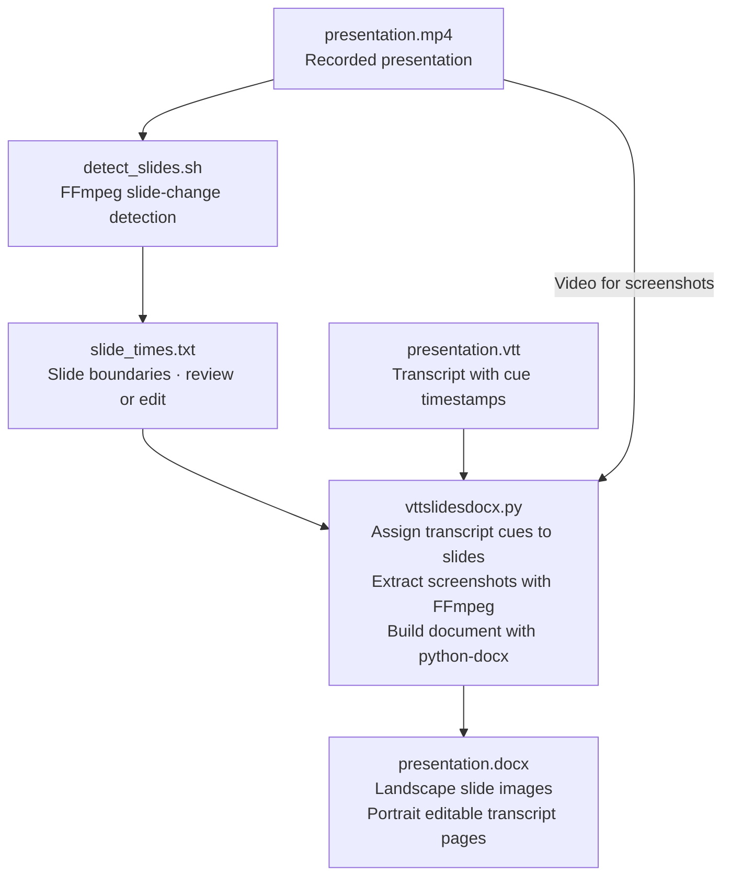

# Presentation Transcript to DOCX

Create a structured Word document from a recorded presentation and its WebVTT (`.vtt`) transcript.

The tool detects slide changes in the presentation video, associates transcript segments with each slide, extracts a screenshot of each slide, and generates a `.docx` document containing alternating slide images and editable transcript text.

The resulting document follows this structure:

```text
Slide 1 screenshot
------------------
Slide 1 — 00:00:00
Transcript associated with slide 1

Slide 2 screenshot
------------------
Slide 2 — 00:02:34
Transcript associated with slide 2

...
```

Slide screenshots are placed alone on landscape pages. Transcript pages contain normal selectable and editable Word text.

## Features

* Detect slide changes automatically from a presentation video
* Use an existing WebVTT (`.vtt`) transcript
* Preserve the timestamp at which each slide appears
* Associate transcript segments with the corresponding slide
* Extract a representative screenshot for every slide
* Capture screenshots shortly before the next slide change so that animations and bullet points are more likely to be fully visible
* Configurable screenshot offset with `--lead`
* Handle short-duration slides automatically
* Optionally crop the video to analyze only the presentation area
* Generate a Microsoft Word `.docx` file
* Place slide screenshots alone on landscape pages
* Place transcripts on portrait pages
* Keep transcript text fully selectable, editable and copyable
* Run entirely locally
* No API or cloud service required

## Processing pipeline



Slide detection uses the video; the VTT keeps its timestamps so the Python script can match the spoken text to each slide. Review or edit `slide_times.txt` before generating the document, and reuse it when regenerating the DOCX.

## Requirements

The project requires:

* [Python 3](https://www.python.org/downloads/) — downloads and installation instructions
* [FFmpeg and FFprobe](https://ffmpeg.org/download.html) — download options for macOS, Linux, and Windows
* [python-docx](https://python-docx.readthedocs.io/en/latest/user/install.html) — installed through `requirements.txt` below

FFmpeg normally includes `ffprobe`. Install these system tools separately; `requirements.txt` installs only the Python dependencies. Both `ffmpeg` and `ffprobe` must be available on your `PATH`.

### macOS

The easiest way to install FFmpeg is with [Homebrew](https://brew.sh/):

```bash
brew install ffmpeg
```

Verify the installation:

```bash
ffmpeg -version
ffprobe -version
```

## Installation

Clone the repository:

```bash
git clone https://github.com/YOUR_USERNAME/presentation-transcript-docx.git
cd presentation-transcript-docx
```

Make the scripts executable:

```bash
chmod +x detect_slides.sh vttslidesdocx.py
```

Create and activate a Python virtual environment, then install the Python dependencies from [requirements.txt](requirements.txt):

```bash
python3 -m venv .venv
source .venv/bin/activate
python3 -m pip install -r requirements.txt
```

Run these commands from the repository directory. If you already have an active virtual environment, just run the last command. For help with Python environments or pip, see the [Python Packaging installation guide](https://packaging.python.org/en/latest/tutorials/installing-packages/).

## Input files

You need two files for each presentation:

```text
presentation.mp4
presentation.vtt
```

Other video formats supported by FFmpeg can also be used.

The VTT file should contain timestamped transcript entries such as:

```text
WEBVTT

00:00:14.081 --> 00:00:27.931
So, guten Morgen. Ich begrüße Sie zur ersten Vorlesung.

00:00:28.971 --> 00:00:34.831
I mag katzen.
```

## Usage

After installing the dependencies, run these two commands from the repository directory:

```bash
./detect_slides.sh presentation.mp4
python3 vttslidesdocx.py presentation.vtt slide_times.txt presentation.mp4
```

### 1. Detect slide changes

`detect_slides.sh` runs FFmpeg's scene-change detector and writes `slide_times.txt` in the current directory. To choose another output file:

```bash
./detect_slides.sh presentation.mp4 my_slide_times.txt
```

Paths containing spaces should be quoted. Use `./detect_slides.sh --help` for options.

The resulting file will look similar to:

```text
35.240
92.560
181.400
247.080
```

Each timestamp represents the moment a new slide appears.

Slide 1 is assumed to start at `00:00:00`. If no changes are detected, the timestamp file is empty and the whole video is treated as one slide. An existing timestamp file is replaced only after detection succeeds.

### Adjusting slide detection

The default threshold is `12`. If animations or incremental bullet points cause too many detections, increase it to `14–16`:

```bash
./detect_slides.sh presentation.mp4 --threshold 14
```

If real slide changes are missed, decrease it to `8–10`. The accepted range is `0–100`.

### 2. Generate the DOCX

Run:

```bash
python3 vttslidesdocx.py \
  presentation.vtt \
  slide_times.txt \
  presentation.mp4
```

If using the virtual environment:

```bash
.venv/bin/python vttslidesdocx.py \
  presentation.vtt \
  slide_times.txt \
  presentation.mp4
```

The output filename is optional. By default, `presentation.mp4` produces `presentation.docx` in the same directory as the video. To choose a different output path, supply it as the fourth positional argument:

```bash
python3 vttslidesdocx.py presentation.vtt slide_times.txt presentation.mp4 notes.docx
```

Use `--date DD.MM.YYYY` to add the course date to the filename:

```bash
python3 vttslidesdocx.py presentation.vtt slide_times.txt presentation.mp4 --date 17.09.2026
```

This creates `2026_09_17-presentation.docx` beside the video. The date also prefixes a custom filename: `notes.docx --date 17.09.2026` produces `2026_09_17-notes.docx` in the chosen output directory. Invalid dates are rejected.

The generated document will contain:

```text
Landscape page
    Slide 01 screenshot

Portrait page
    Slide 01 — 00:00:00.000
    Transcript...

Landscape page
    Slide 02 screenshot

Portrait page
    Slide 02 — 00:00:35.240
    Transcript...

...
```

## Screenshot timing

By default, the script captures the screenshot of a slide **5 seconds before the following slide appears**.

For example:

```text
Slide 4 starts:     00:10:00
Slide 5 starts:     00:12:30
Screenshot Slide 4: 00:12:25
```

This is useful for presentations where bullet points, diagrams or other elements appear progressively.

The delay can be changed with:

```bash
--lead
```

For example, to capture slides 2 seconds before the next slide change:

```bash
python3 vttslidesdocx.py \
  presentation.vtt \
  slide_times.txt \
  presentation.mp4 \
  --lead 2
```

For very short slides, the script automatically chooses a suitable frame within the slide instead.

## Cropping the presentation

If the video contains additional content such as:

* presenter webcam
* borders
* control panels
* chat windows
* other screen elements

the screenshot can optionally be cropped.

Use:

```bash
--crop W:H:X:Y
```

For example:

```bash
python3 vttslidesdocx.py \
  presentation.vtt \
  slide_times.txt \
  presentation.mp4 \
  --crop 1600:1080:0:0
```

This extracts a `1600 × 1080` area starting at coordinates `0,0`.

Use the same crop during detection to prevent movement outside the slides from being interpreted as scene changes. Detection crops before scaling:

```bash
./detect_slides.sh presentation.mp4 --crop 1600:1080:0:0
python3 vttslidesdocx.py presentation.vtt slide_times.txt presentation.mp4 --crop 1600:1080:0:0
```

## Notes

Slide detection is based on visual scene changes and therefore may require some threshold tuning depending on the presentation.

Presentations containing many animations, transitions or progressively appearing elements may generate false slide detections.

Keeping `slide_times.txt` as an intermediate file is useful because it allows the detected slide boundaries to be inspected or manually corrected before generating the final Word document.

Once `slide_times.txt` is correct, the `.docx` can be regenerated without running scene detection again.

## License

I don't care, do want you want with this project. The AI coded 90% of it, it belongs to the people.
